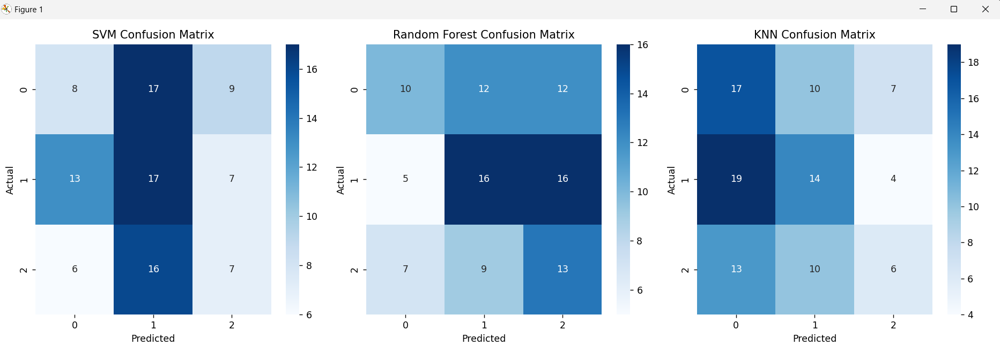
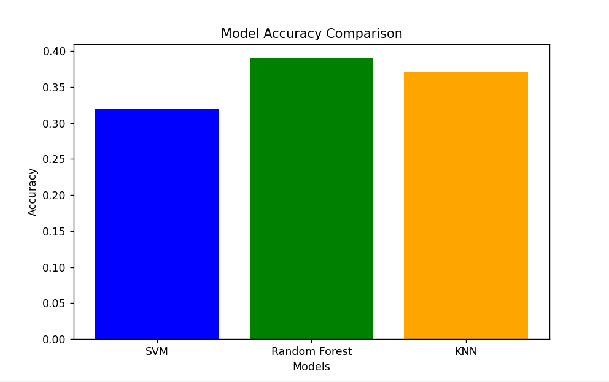

# Bug Prediction ML Model

This repository contains a machine learning script for predicting bug severity based on the provided dataset. The script preprocesses the data, trains multiple machine learning models, and evaluates their performance using accuracy, classification reports, confusion matrices, and visualizations.

## Features
- Data preprocessing:
  - Handling missing values
  - Encoding categorical variables
  - Feature normalization
- Machine learning models:
  - Support Vector Machine (SVM)
  - Random Forest
  - K-Nearest Neighbors (KNN)
- Performance evaluation:
  - Accuracy comparison
  - Classification report (in tabular format)
  - Confusion matrix visualization
  - Heatmap of F1-scores

## Requirements
Install the required Python packages using the following command:

```bash
pip install pandas numpy scikit-learn matplotlib seaborn
```

## Usage

1. Place your dataset (CSV file) in the specified location.
2. Update the `dataset_path` variable in the script with the path to your dataset.
3. Run the script using:

```bash
python bug_prediction.py
```

## Input
- **Dataset:** The input dataset should be a CSV file with a target column `Severity`. Features can be numerical or categorical.

## Output
### Console Output
- Combined classification report in a tabular format for all models:
  - Metrics: Precision, Recall, F1-score, and Support

### Visualizations
1. **Classification Report Heatmap:**
   - Displays F1-scores for each model and class.

   

2. **Confusion Matrices:**
   - Separate confusion matrices for SVM, Random Forest, and KNN.

   

3. **Accuracy Comparison Bar Chart:**
   - Compares the overall accuracy of the models.

   

## Example Output






## Code Overview
### Key Steps:
1. **Data Loading:** Loads the dataset from the specified path.
2. **Preprocessing:**
   - Fills missing values using forward fill.
   - Encodes categorical variables using `LabelEncoder`.
   - Normalizes features using `StandardScaler`.
3. **Model Training:**
   - Trains SVM, Random Forest, and KNN models.
4. **Evaluation:**
   - Calculates accuracy scores for each model.
   - Generates classification reports.
   - Plots confusion matrices and F1-scores.
5. **Visualization:**
   - Heatmaps for F1-scores.
   - Bar chart for accuracy comparison.

## Customization
- Change the `Severity` column name in the script if your dataset uses a different target column.
- Modify model parameters to optimize performance.


